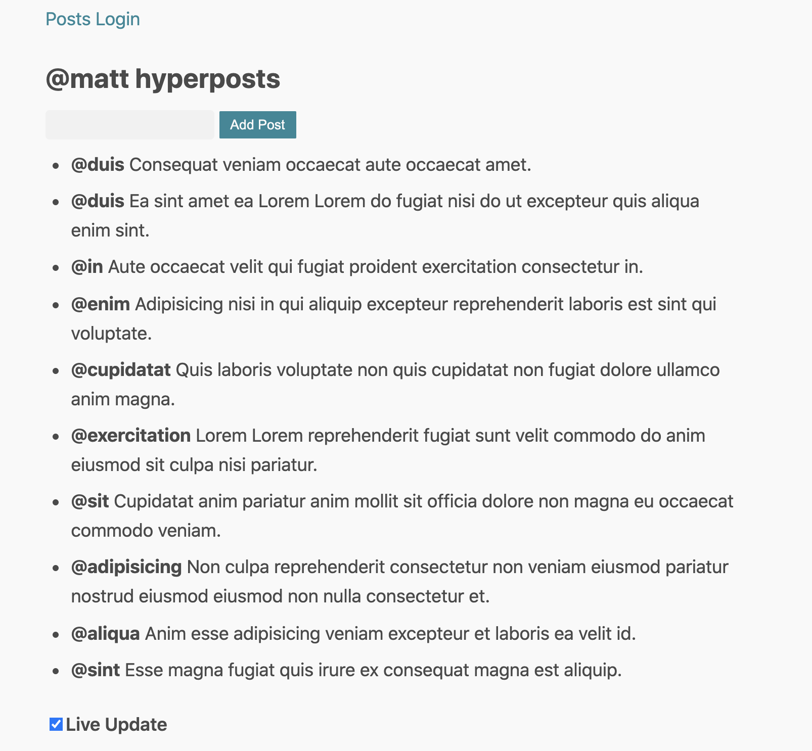

# Chapter 1: Elevator Pitch

## Why do we need another framework?


> We have lost our ability of achieving more with less. We do more with more. Or, in certain cases, we do less with more.

Modern frontend development is very complicated:
* frameworks with 10000k+ LOC, impenetrable at the source code level to non-core developers
* libraries with huge API surface area and tens of methods/operators to learn
* more and more JS "the bad parts", mostly from the class-based programming
* complex tooling to make everything work and taking away all the fun
* layers upon layers of proprietary abstractions on top of the browser APIs
* elaborate performance tricks to improve performance
* code mixing side-effects and application logic 
* testing techniques with mock imports encouraging untestable code

## What is your elevator pitch?


```
For JS developers. 
Who need to build highly interactive Web interfaces  
Hyperapp is a functional view and state management framework
That allows for writing easy to understand, performant and testable code
Unlike other JS frameworks
Hyperapp fits in one 422 LOC file with zero dependencies and facilitates programming in a tiny subset of JS "the very best parts".
```
In this book, we'll try to back up this bold statement. 

## Learning outcomes

By the end of this book, you will learn to:
* develop frontend code using mostly pure functions and object literals 
* setup build tool-free development workflow to avoid tooling fatigue
* render views as simple functions, not stateful components
* model application state to make impossible states impossible
* change application state with pure functions
* talk to HTTP APIs and stream server events without callbacks, promises, async/await, observables in the user space
* describe all side effects (e.g. random number generation) as data structures
* optimize load time and runtime performance 
* test your application at the unit and integration level
* route between different pages
* integrate with 3rd party libraries
* render frontend views on the server
* deploy your code to production
* appreciate the benefits of the minimalist approach to software development that lands you in a "pit of success"

## Introducing the problem

You will be building a messaging/chat application called **HyperPosts**. We decided to choose a boring and familiar domain purposefully. 
To ease the learning process, you will only focus on the framework concepts instead of learning new and unfamiliar domain.

You will find a deployed version of this app on Netlify: https://hyperposts.netlify.app/

You will find the source code on Github: https://github.com/kwasniew/hyperbook-tutorial

Throughout the book, you'll be building two application screens:

* the main screen with a simple form and a list of posts streamed from the server



* the login screen to set your username

