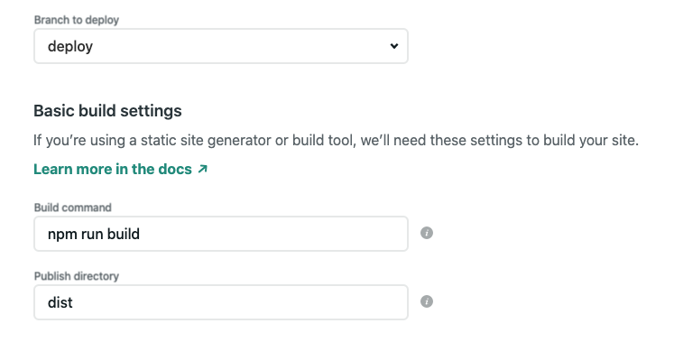

# Chapter 15: Production

## Preparing code for production

Before you ship your code to production you may need to:
* translate modern ES6+ code to ES5 so older browsers can understand it
* bundle your JS files to avoid serving too many files

If you're only targeting modern browsers and serving code over HTTP/2, you may skip those steps. Seriously. If you're doing a greenfield internal project, you don't need to worry about old and buggy browsers. Everything you did so far will work without an additional build. 

In this book we use [Parcel](https://parceljs.org/) - a zero-configuration bundler.

First, install parcel:
`npm i parcel -D`

`-D` adds it to `devDependencies` during installation.

Add a script to build your production code:
```json
  "scripts": {
    "build": "parcel build src/index.html"
  }
```
Time to build your project:
`npm run build`

The parcel will generate a `dist` directory with the optimized production code.

Verify your production distribution locally:
`http-server dist`

Current Parcel version (1.x) has a bug causing `console.error`: `Uncaught ReferenceError: parcelRequire is not defined`.
It will be fixed in the Parcel 2 release.

## Deploying code to Netlify

We're using [Netlify](https://www.netlify.com/) to host this project. In the following figure, you will find the deployment settings:



Once you connect your Github repo to Netlify configure:
* branch to deploy: we're using a branch called [parcel](https://github.com/kwasniew/hyperbook-tutorial/tree/parcel). On [master](https://github.com/kwasniew/hyperbook-tutorial/tree/master), there is a lightweight setup without a bundler.
* build command: `npm run build` from the previous step
* publish directory: `dist` a default Parcel directory

Every time you push to the branch, Netlify will deploy a new version.

You can find the latest deployed version here: https://hyperposts.netlify.app/

## Optimizing code size

One of the most underrated performance optimizations is using lighter frameworks and libraries.

Use bundlephobia to check the size of your dependencies (minified+gzipped):
* https://bundlephobia.com/result?p=hyperapp@2.0.4 (1.9kB)
* https://bundlephobia.com/result?p=hyperapp-fx@2.0.0-beta.1 (1.6kB)
* https://bundlephobia.com/result?p=@hyperapp/events@0.0.4 (0.8kB)
* https://bundlephobia.com/result?p=htm@3.0.4 (0.7kB)
* https://bundlephobia.com/result?p=page@1.11.6 (3.9kB)

To make this comparison relevant here are some of the popular libraries:
* https://bundlephobia.com/result?p=@angular/core@9.1.7 (90kB)
* https://bundlephobia.com/result?p=react-dom@16.13.1 (36kB)
* https://bundlephobia.com/result?p=vue@2.6.11 (22.8kB)

Using Hyperapp is a performance optimization in and of itself. In other words, with Hyperapp
you're paying a much much lower performance tax than in Angular, React, or Vue. 
No matter how many performance optimizations you apply to them, they will never match the load time performance of unoptimized Hyperapp. And that's what we call a performance [pit of success](https://blog.codinghorror.com/falling-into-the-pit-of-success/).
Or a negligible performance tax. 

The received wisdom that you need to choose between developer experience and load time performance becomes a false dichotomy. 
No matter what performance metric you choose be it [FCP](https://web.dev/first-contentful-paint/), [LCP](https://web.dev/lcp/), [TTI](https://web.dev/interactive/), [FID](https://web.dev/fid/), [TBT](https://web.dev/tbt/) 
you'll be fine. Even if you're scratching your head thinking: WTF are those metrics (WTF stands for "What's this for").

Check your application bundle size in the browser:


With minification and Brotli compression (from the Netlify server), the application is only 10kB. 
It easily fits into most real-world [performance budgets](https://web.dev/performance-budgets-101/). It means that Hyperapp is a great tool when you need to build apps for the network and CPU constrained devices, without sacrificing developer experience.

Note: We're using scope hoisting/tree shaking feature of Parcel `parcel build src/index.html --experimental-scope-hoisting`.
Without this optimization, the application was 12kB.

