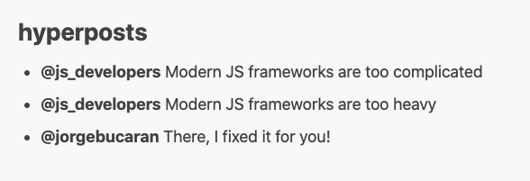
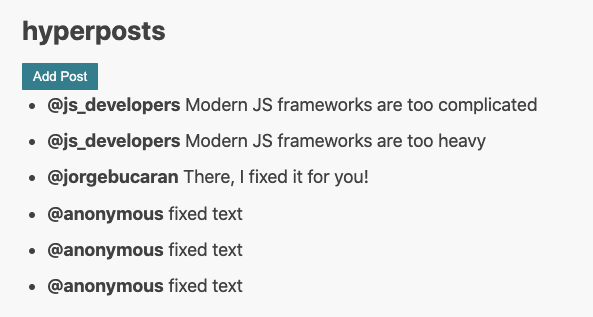

# Chapter 4: Functional data flow

## Splitting view into smaller functions

In the previous chapters you rendered static HTML with hardcoded nodes. 
The next code snippet shows how to render a dynamic view with a list of posts.

```js
import { h, app } from "./web_modules/hyperapp.js";
import htm from "./web_modules/htm.js";

const html = htm.bind(h);

const state = {
  posts: [
    {
      username: "js_developers",
      body: "Modern JS frameworks are too complicated",
    },
    { username: "js_developers", body: "Modern JS frameworks are too heavy" },
    { username: "jorgebucaran", body: "There, I fixed it for you!" },
  ],
};

const listItem = (post) => html`
  <li>
    <strong>@${post.username}</strong>
    <span> ${post.body}</span>
  </li>
`;

const view = (state) => html`
  <div>
    <h1>Recent Posts</h1>
    <ul>
      ${state.posts.map(listItem)}
    </ul>
  </div>
`;

app({
  init: state,
  view,
  node: document.getElementById("app"),
});
```
```view``` is extracted into a separate function.
Inside the ```view``` you map over a list of ```posts``` and render each of them using ```listItem``` view fragment. 
As a rule of thumb, if your view gets too big, split it into **smaller view fragments**. 
Pass as much state as needed. For example: ```listItem``` only needs a single ```post``` parameter.

At the end of this section your view should look like this:


## Changing state with actions

**Actions** bring interactivity to your application. As users click buttons or type some text, you want to react to those events.

First, add a button just below the ```h1``` element:
```js
<h1>Recent Posts</h1>
<button onclick=${AddPost}>Add Post</button>
```
The ```onclick``` attribute translates to the DOM API click events. 
More precisely, Hyperapp translates the ```onclick``` into ```button.addEventListener('click')```. 
Everything you know about the DOM API is still relevant and transferable. 
There's no extra framework-specific events to learn.

Add the action itself. Put it between the state and view declarations:
```js
const AddPost = (state) => {
  const newPost = { username: "anonymous", body: "fixed text" };
  return { ...state, posts: [newPost, ...state.posts] };
};
```
```AddPost``` is a pure function mapping previous state to the new state. 
When you click a button, Hyperapp automatically passes previous state to your action. 
```newPost``` is created and added to the beginning of the posts list. 
A common pattern is to destructure previous state and only update those properties that change. 
Our current state has no other properties, but the code is future proofed. 
To keep your state updates simple, model your state as flat objects. The more nesting you do, the more
elaborate update strategies you will need (e.g. [lenses](https://randycoulman.com/blog/2016/07/12/thinking-in-ramda-lenses/)). 

The following figure shows the same action in a visual format:


Test your app in the browser and click the **Add Post** button several times. New items should be added to the list.




## Understanding functional data flow

Hyperapp **data flow** is inspired by the [Elm Architecture](https://guide.elm-lang.org/architecture/):
* view **V** interaction (e.g. click) triggers some action **A** 
* action **A** creates a new state **S**
* new state **S** causes re-render of the view **V** 


As a Hyperapp user you declare all the views, actions and the initial state. 
Hyperapp connects the circles and takes care of:
* handling events
* dispatching actions
* re-rendering the view

This approach makes your code very declarative as you never have to perform fine-grained view updates. 
At any given time, your view is the HTML/DOM projection of your current state.
And state is the ultimate source of truth. 
In other words, state is not spread across many JS components or even worse, in the DOM itself.

Note: with Hyperapp there's no need to use classes extending from a framework superclass or to decorate your code with framework specific annotations. 
View and actions are pure functions and state is a plain JS object. 
Therefore, cognitive overhead from unnecessary language features is minimal.
