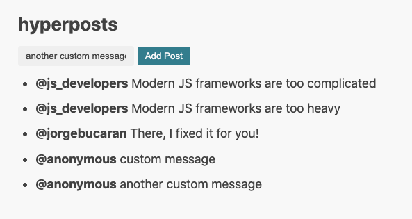

# Chapter 5: Actions and DOM events

## Modelling state

You already implemented a button click action. It always adds a post with the same text. 

Add an input field to change the text:
```javascript
<h1>Recent Posts</h1>
<input type="text" autofocus />
<button onclick=${AddPost}>Add Post</button>
```

When you start typing some text, your state and view will get out of sync. What you're typing is not
reflected in the state change.
One of the tenets of functional UI architecture is continuous synchronization of state and view. 
View reacting to state changes, and state changes reacting to view actions. 
To make this work, you need some part of your state to model the contents of the input field. 

Create a new state property named ```currentPostText```:
```javascript
const state = {
  currentPostText: "type your text",
  posts: [...]
};
```
Read the new property in your view:
```javascript
<input type="text" value=${state.currentPostText} autofocus />
```
DOM attribute called ```value``` sets the text of the input field to the ```currentPostText```.

## Accessing DOM events

Input text reflects ```currentPostText``` from the state object. You want to close the circle with DOM events changing the state.

Add DOM ```oninput``` attribute to trigger ```UpdatePostText``` action on input changes:
```javascript
<input type="text" oninput=${UpdatePostText} value=${state.currentPostText} autofocus />
```

Add a new action next to the ```AddPost``` action:
```javascript
const UpdatePostText = (state, event) => ({
    ...state,
    currentPostText: event.target.value
});
```
Compare ```UpdatePostText``` signature with ```AddPost``` signature.

```
(oldState) => newState
(oldState, event) => newState
```
Hyperapp actions accept either ```(oldState)``` or ```(oldState, event)```. 
With a second attribute provided, Hyperapp will inject both sources of information to your action.
The ```event``` is a regular DOM event, therefore we can access ```event.target.value``` from DOM Event API. 
As mentioned before, it's all about transferable skills. 

The following figure shows updated conceptual model of Hyperapp actions with an extra event parameter:


Try to add a new post with some text. It should still not work. You need to copy the ```currentPostText``` to the newly added post.

```javascript
const AddPost = (state) => {
  const newPost = { username: "anonymous", body: state.currentPostText };
  return { ...state, posts: [newPost, ...state.posts] };
};
```

With this change, you can start adding custom messages to the list.



## Extracting repetitive event data

All event based actions will follow similar pattern:
```javascript
(oldState, event) => {
    const userData = event.target.value;
    ....
}
```
Action code would be cleaner if it didn't know about DOM Event API.

Create a **selector function** to extract part of the event you care about:
```javascript
const targetValue = event => event.target.value;
```
Eventually, you'll move this code to a library but for now put it somewhere above your view declarations.

Switch ```UpdatePostTest``` to use the new function:
```javascript
const UpdatePostText = (state, event) => ({
    ...state,
    currentPostText: targetValue(event)
});
```
The code is still dependent on the ```targetValue``` function.

Ideally, you'd like the action to accept only the data it needs:
```javascript
const UpdatePostText = (state, currentPostText) => ({
    ...state,
    currentPostText
});
```
Shape the second argument of your action inside the input handler. 
```javascript
<input type="text" oninput=${[UpdatePostText, targetValue]} value=${state.currentPostText} autofocus />
```
A two argument array with an action and a selector applies the event selector before the action is invoked. 
In our case ```targetValue``` is applied to DOM event before invoking ```UpdatePostText```.

If you keep using the ```[action, selector]``` array over and over, consider creating an alias:
```javascript
const UpdatePostTestAction = [UpdatePostText, targetValue];
```
As you don't have a second usage of this pattern yet, withhold this decision for now. 

## Exercise: cleaning text input

According to [modern reaserch](https://en.wikipedia.org/wiki/Desirable_difficulty), testing your knowledge is essential for learning. 
If you want to get the most out of this book please do the exercises. They are not optional.

Your application doesn't clear the input text after adding a new post.
Modify the ```AddPost``` action to reset ```currentPostText```. 
Also make sure the initial text is empty.
When you're done compare with the solution below.
But first, try to do it on your own. 

<details>
    <summary id="cleaning_text_input">Solution</summary>

```javascript
const AddPost = (state) => {
  const newPost = { username: "anonymous", body: state.currentPostText };
  return { ...state, currentPostText: "", posts: [newPost, ...state.posts] };
};
```

</details>

## Exercise: checking empty input

After we clean the input, users may be tempted to submit empty text. Your task is to prevent them from doing so.
Application should ignore **Add Post** clicks when the text is empty.

<details>
    <summary id="checking_empty_input">Solution</summary>

```javascript
const AddPost = (state) => {
  if(state.currentPostText.trim()) {
      const newPost = { username: "anonymous", body: state.currentPostText };
      return { ...state, currentPostText: "", posts: [newPost, ...state.posts] };
  }  else {
      return state;
  }
};
```

</details>