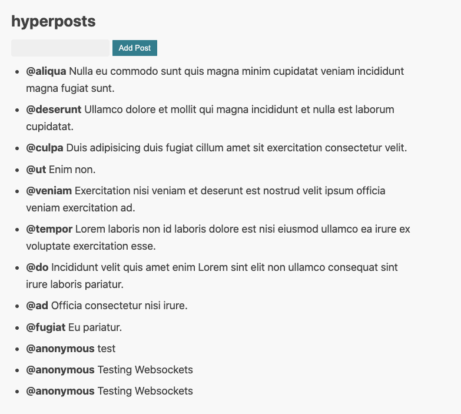
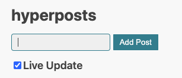

# Chapter 7: Subscriptions

## Understanding long-running effects (subscriptions)

The HTTP effect you've been using so far was **short-lived**. A request is sent, a response arrives, and the effect is over.
Not all effects follow this pattern. E.g. if you open a connection to a WebSocket it will be running for a long time.
It doesn't fit the short-lived HTTP request-response model. 

In Hyperapp you use **subscriptions** to handle those **long-lived** effects. 

To build intuition about subscriptions, look at different sources that fit this model:
* WebSockets
* setInterval
* mouse moves
* keyboard key presses
* history/URL changes 

What they have in common is a long-lived nature of the underlying event source. 

Note: I'll refer to short-lived effects as just effects and the long-lived effects as subscriptions.

## Implementing subscriptions

In this section, you will subscribe to the WebSocket stream with post updates.

Import subscription definition:
```js
import { Http, WebSocketListen } from "./web_modules/hyperapp-fx.js";
```
hyperapp-fx uses `*Listen` convention to name subscription creating functions.

Write an action for handling incoming WebSocket events:
```js
const SetPost = (state, event) => {
  try {
    const post = JSON.parse(event.data);
    return {
      ...state,
      posts: [post, ...state.posts],
    };
  } catch (e) {
    return state;
  }
};
```
The event is the underlying `MessageEvent` from the WebSocket API. You parse the `data` property of the event. 
If the data is a valid JSON post, you add it to the beginning of the post list. In case of a parsing error, you don't change the state of the application.

Plug the subscription and the action into the application:
```js
app({
  init: [state, LoadLatestPosts],
  view,
  subscriptions: (state) => [
    WebSocketListen({
      action: SetPost,
      url: "ws://hyperapp-api.herokuapp.com",
    }),
  ],
  node: document.getElementById("app"),
});
```
`WebSocketListen` function expects an object with `action` and `url`.
Since WebSockets is a different protocol from HTTP, the URL scheme is `ws://` not `http://`.

Test your application. Add a new post. 



The post should be added to the list twice. 
Directly from the local state update and a few milliseconds later from a WebSocket success action. 
You'll fix this behaviour in the next exercise. 
For now, test your WebSocket connection in two different browser windows. See if the messages are propagated correctly.

Diagnosing problems with WebSockets:
* make sure the HTTP protocol switched to WebSockets


* click on the switching protocols raw and find the actual message


## Exercise: avoiding duplicate posts

Your task is to change the code so that it only adds a post from the WebSocket. 
Modify the `AddPost` action and stop adding `newPost` until we receive a confirmation from the server.

<details>
    <summary id="avoiding_duplicate_posts">Solution</summary>

Inside `AddPost` action change this code:
```js
    const newState = {
      ...state,
      currentPostText: "",
      posts: [newPost, ...state.posts],
    };
```
To this:
```js
    const newState = {
      ...state,
      currentPostText: ""
    };
```

</details>

## Writing your own subscription

In this section, you'll write your subscription for [Server-Sent Events](https://www.smashingmagazine.com/2018/02/sse-websockets-data-flow-http2/).

Server-Sent Events (SSE) is a lesser-known, but much simpler HTTP-native alternative to WebSockets. 
SSE also handles network failures more gracefully than plain WebSockets. It can automatically reconnect on failed connections.

In [Writing your own effects](ch6.md#writing-your-own-effects) section you defined effects as follows:
```js
const httpEffect = (dispatch, data) => {};
```

Start with the same signature for the subscription definition:
```js
const eventSourceSubscription = (dispatch, data) => {};
```

The browser API for SSE is called the `EventSource`:
```js
const es = new EventSource("https://hyperapp-api.herokuapp.com/api/event/post");
es.addEventListener("message", event => /* handle event with a data field */)
```
`EventSource` is a regular event emitter similar to a clickable button.

Wrap the API into your subscription definition:
```js
const eventSourceSubscription = (dispatch, data) => {
  const es = new EventSource(data.url);
  es.addEventListener("message", (event) => dispatch(data.action, event));
};
```
`data` parameter will hold two configuration options: `url` and `action`. 
We follow the same convention that was used in the WebSockets implementation. When SSE notification arrives, dispatch an `action` and pass the server `event`.

In [Writing your own effects](ch6.md#writing-your-own-effects) section you used the following effect signature:
```js
const Http = data => [httpEffect, data];
```

Following the same convention create your own subscription:
```js
const EventSourceListen = data => [eventSourceSubscription, data];
```

Plug the subscription into your application:
```js
app({
  init: [state, LoadLatestPosts],
  view,
  subscriptions: (state) => [
    EventSourceListen({
      action: SetPost,
      url: "https://hyperapp-api.herokuapp.com/api/event/post"
    }),
  ],
  node: document.getElementById("app"),
});
```
Because you followed the same naming convention for `action` and `url`, it should be just a matter of switching `url` and `WebSocketListen` to `EventSourceListen`.

Test your application. It should work the same way as the WebSocket version, but without switching to a different protocol. 

Diagnosing problems with SSE:
* make sure the `eventsource` connection-type was established


* check SSE messages


If your browser [doesn't support SSE](https://caniuse.com/#search=eventsource) use a polyfill:
```html
<script src="https://polyfill.io/v3/polyfill.min.js?features=fetch%2CEventSource%2Cdefault" defer></script>
```

## Understanding differences between init effect and subscription

Looking at your subscription signature, it's not much different from any short-live effect. 
You could event plug the subscription into the init:
```js
app({
    init: [state, [LoadLatestPosts, EventSourceListen({action: SetPost, url: 'https://hyperapp-api.herokuapp.com/api/event/post'})]],
    ...
});
```
Both the short-lived `LoadLatestPosts` action and long-lived `EventSourceListen` subscription are invoked on startup.

If you never need to stop listening to the long-running event source, the subscription is effectively the same as the init action. But, what if you have to stop listening to the subscription?

## Subscription with Cleanup

Return the cleanup function from the subscription definition.
```js
const eventSourceSubscription = (dispatch, data) => {
  return () => {
    // cleanup here
  };
};
```

Fill in this template with your `EventSource` implementation:
```js
const eventSourceSubscription = (dispatch, data) => {
  const es = new EventSource(data.url);
  const listener = (event) => dispatch(data.action, event);
  es.addEventListener("message", listener);

  return () => {
    es.removeEventListener("message", listener);
    es.close();
  };
};
```
The cleanup function removes a listener from the `EventSource` and closes the connection.
`addEventListener` and `removeEventListener` need a reference to the same listener instance. Therefore, put the listener in a shared variable.
But, how do you call the cleanup function? You don't. Hypeapp will call it for you.

## Controlling subscription status

It will be easier to understand the idea if we start with the UI first. Add a capability to enable/disable live updates through the checkbox, as shown in the following figure:



Introduce intial state field called `liveUpdate`:
```js
const state = {
  currentPostText: "",
  posts: [],
  liveUpdate: true
};
```
By default **Live Update** will be enabled.

Add an action to toggle live update:
```js
const ToggleLiveUpdate = state => ({...state, liveUpdate: !state.liveUpdate});
```

Add a UI control for live update just below the **Add Post** button.
```js
    <input
      type="checkbox"
      id="liveUpdate"
      onchange=${ToggleLiveUpdate}
      checked=${state.liveUpdate}
    />
    <label for="liveUpdate">Live Update</label>
```
This checkbox reflects the `liveUpdate` status. Every time the checkbox changes, it toggles the status.
Label for the input field conveniently allows for clicking **Live Update** text to change the settings.

You can control your subscription based on the `liveUpdate` status:
```js
app({
  init: [state, LoadLatestPosts],
  view,
  subscriptions: (state) => [
    state.liveUpdate &&
      EventSourceListen({
        action: SetPost,
        url: "https://hyperapp-api.herokuapp.com/api/event/post",
        event: "post",
      }),
  ],
  node: document.getElementById("app")
});
```
When `state.liveUpdate` is `true` a new subscription gets returned in the subscriptions array. When `state.liveUpdate` is `false`, Hyperapp compares the two arrays and notices that a subscription is removed. It will call its cleanup function for you.
If you're familiar with `useEffect` in React, then you should notice how much more elegant it is. It's not dependent on the order of calls, you don't need to remember to pass an empty array `[]`, and your dependencies are standard JS logic `state.liveUpdate && EventSourceListen(/* ... */)` instead of `[state.liveUpdate]` that's easy to miss.

## Exercise: fetching latest posts on toggle

When the **Live Update** is off you may lose some posts. Therefore, when a user enables the live update, load the latest posts.
Modify `ToggleLiveUpdate` to `LoadLatestPosts` when appropriate.

<details>
    <summary id="fetching_posts_on_toggle">Solution</summary>

```js
const ToggleLiveUpdate = (state) => {
  const newState = {
    ...state,
    liveUpdate: !state.liveUpdate,
  };
  return newState.liveUpdate ? [newState, LoadLatestPosts] : [newState]
};
```

</details>
