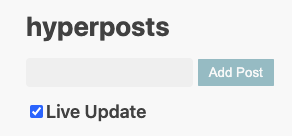

# Chapter 8: Modeling state

## Handling slow API

Switch ```SavePost``` to a new url with the slow API.
```js
const SavePost = (post) =>
  Http({
    url: "https://hyperapp-api.herokuapp.com/slow-api/post",
    ...
  });
```
When you test the app ```SavePost``` should take about 3 seconds before a notification arrives. 
While waiting for the response you can send more requests without getting confirmation that the previous ones succeeded. 
Assume you have a requirement to disable the **Add Post** button while the post is saving.

Enhance initial state with the ```isSaving``` property.
```js
const state = {
  currentPostText: "",
  posts: [],
  liveUpdate: true,
  isSaving: false
};
```

Map the property to the button ```disable``` property:
```js
<button onclick=${AddPost} disabled=${state.isSaving}>Add Post</button>
```
The button reflects the current state of the saving operation.

```AddPost``` action disables the button:
```js
const AddPost = (state) => {
    ...
    const newState = {
      ...state,
      currentPostText: "",
      isSaving: true,
    };
    ...
};
```

```SavePost``` effectful action enables the button on a successful response.
It invokes a newly created ```PostSaved``` action:
```js
const PostSaved = (state) => ({ ...state, isSaving: false });

const SavePost = (post) =>
  Http({
    ...
    action: PostSaved,
  });
```

Test your disable button capability.



## Handling API errors

Switch ```SavePost``` to a new url with API returning error responses.
```js
const SavePost = (post) =>
  Http({
    url: "https://hyperapp-api.herokuapp.com/error-api/post",
    ...
  });
```
The new API is not only slow, but also returns 500 errors.

Enhance initial state with the ```error``` property:
```js
const state = {
  currentPostText: "",
  posts: [],
  liveUpdate: true,
  isSaving: false,
  error: ""
};
```
Eventually you will populate this field with an error value.

Expose the ```error``` in the UI:
```js
<div>${state.error}</div>
<button onclick=${AddPost} disabled="${state.isSaving}">Add Post</button>
```
You should put the error just above the **Add Post** button.

Add ```PostError``` action that will be triggered on HTTP errors. 
```js
const PostSaved = state => ({...state, isSaving: false});
const PostError = state => ({...state, isSaving: false, error: "Post cannot be saved. Please try again."});

const SavePost = (post) =>
  Http({
    ...
    action: PostSaved,
    error: PostError
  });
```
hyperapp-fx ```Http``` effect has a special error field for the error handling action.
```PostError``` should enable the **Add Post** button and set the UI friendly error message. 

Test your application. 


After the post submission the error is displayed. 
However, when you start typing a new text the error is still there. 
I'd expect the error to disappear at this point. 
You can change ```SetPost``` action to remove the error message, but in the next section you'll see a better way to model our state.

## Modeling only valid states

Take a look at the last 2 fields you added to the state:
```js
const state = {
  ...
  isSaving: false,
  error: ""
};
```

4 possible combinations can be triggered:
* ```isSaving: false``` and empty error (request is idle, user is typing a new message)
* ```isSaving: false``` and non-empty error (request error after form submission)
* ```isSaving: true``` and empty error (request is pending)
* ```isSaving: true``` and non-empty error (should be impossible)

The last combination should be impossible. But the way we modeled our state makes it possible. 
Of course you can write some tests to verify the combination never occurs. But you can also model your state to **make the impossible state impossible**.

Imagine a concept of a request status.
The request status can be in 1 of 3 states:
* ```{status: "idle"}```
* ```{status: "pending"}```
* ```{status: "error", message: "Post cannot be saved. Please try again."}```

In the next section you'll implement it.

## Implementing only valid states

Introduce 3 valid states we defined in the modeling exercise and set the ```idle``` status as the initial one.
```js
const idle = { status: "idle" };
const saving = { status: "saving" };
const error = {
  status: "error",
  message: "Post cannot be saved. Please try again.",
};
const state = {
  currentPostText: "",
  posts: [],
  liveUpdate: true,
  requestStatus: idle,
};
```
A common strategy to scale a growing state object is to split it into smaller objects and combine them.

Find all the places where you were setting ```isSaving``` and ```error``` properties and replace them with ```requestStatus```. 

```AddPost``` sets the status to ```saving```:
```js
const AddPost = (state) => {
    ...
    const newState = {
      ...state,
      currentPostText: "",
      requestStatus: saving
    };
    ...
};
```

```PostSaved``` sets the status to ```idle```:
```js
const PostSaved = (state) => ({ ...state, requestStatus: idle });
```

```PostError``` sets the status to ```error```:
```js
const PostError = (state) => ({ ...state, requestStatus: error });
```

Map request status to the ```errorMessage``` view fragment:
```js
const errorMessage = ({ status, message }) => {
  if (status === "error") {
    return html` <div>${message}</div> `;
  }
  return "";
};
```
Map request status to the button ```disabled``` status:
```js
const addPostButton = ({ status }) => html`
  <button onclick=${AddPost} disabled=${status === "saving"}>Add Post</button>
`;
```

Delete those two lines:
```js
<div>${state.error}</div>
<button onclick=${AddPost} disabled=${state.isSaving}>Add Post</button>
```

And replace them with your new view fragments:
```js
${errorMessage(state.requestStatus)}
${addPostButton(state.requestStatus)}
```
A strategy to scale growing view functions is to split them into smaller view fragments and delegate to them.

## Exercise: removing error when typing a new post

Modify the ```UpdatePostText``` action to remove the error message when a user starts typing a new post.

<details>
    <summary id="cleaning_text_input">Solution</summary>

```js
const UpdatePostText = (state, currentPostText) => ({
  ...state,
  currentPostText,
  requestStatus: idle
});
```

</details>

After this part revert your API ```url``` in ```SavePost``` to: https://hyperapp-api.herokuapp.com/api/post
